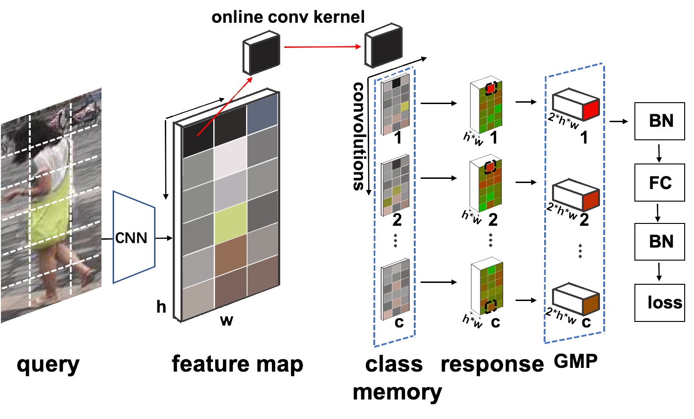

# QAConv
Interpretable and Generalizable Person Re-Identification with Query-Adaptive Convolution and Temporal Lifting

This is the official PyTorch code for the QAConv method proposed in our paper [1]. A Chinese blog is available in [再见，迁移学习？可解释和泛化的行人再辨识](https://mp.weixin.qq.com/s/ukZgCsGdig0jE6jmkpBbbA).

# Updates

* 3/3/2022: The Graph Sampling work (QAConv-GS/QAConv 2.1) has been accepted by CVPR 2022.
* 9/29/2022: [TransMatcher](https://arxiv.org/abs/2105.14432) has been accepted by NeurIPS 2021.
* 9/19/2021: Include [TransMatcher](https://github.com/ShengcaiLiao/QAConv/tree/master/projects/transmatcher), a transformer based deep image matching method based on QAConv 2.0.
* 9/16/2021: QAConv 2.1: simplify graph sampling, implement the Einstein summation for QAConv, use the batch hard triplet loss, design an adaptive epoch and learning rate scheduling method, and apply the automatic mixed precision training.
* 4/1/2021: QAConv 2.0 [2]: include a new sampler called Graph Sampler (GS), and remove the class memory. This version is much more efficient in learning. See the updated [results](#Performance).
* 3/31/2021: QAConv 1.2: include some popular data augmentation methods, and change the ranking.py implementation to the original open-reid version, so that it is more consistent to most other implementations (e.g. open-reid, torch-reid, fast-reid).
* 2/7/2021: QAConv 1.1: an important update, which includes a pre-training function for a better initialization, so that the [results](#Performance) are now more stable.
* 11/26/2020: Include the IBN-Net as backbone, and the [RandPerson](https://github.com/VideoObjectSearch/RandPerson) dataset.

# Illustrations


Fig. 1. Illustration of the proposed query-adaptive convolution (QAConv).


Fig. 2. Examples of local correspondences obtained by QAConv.


Fig. 3. QAConv network architecture in training.


Fig. 4. Illustration of the proposed temporal lifting (TLift).

# Requirements

- Pytorch (>1.0)
- sklearn
- scipy

# Usage
Download some public datasets (e.g. Market-1501, CUHK03-NP, MSMT) on your own, extract them in some 
folder, and then run the followings.

## Training and test
`python main.py --dataset market --testset cuhk03_np_detected[,msmt] [--data-dir ./data] [--exp-dir ./Exp]`

For more options, run "python main.py --help". For example, if you want to use the ResNet-152 as backbone, specify "-a resnet152". If you want to train on the whole dataset (as done in our paper for the MSMT17), specify "--combine_all".

With the GS sampler and pairwise matching loss, run the following:

``python main_gs.py --dataset market --testset cuhk03_np_detected[,msmt] [--data-dir ./data] [--exp-dir ./Exp]``

## Test only
`python main.py --dataset market --testset duke[,market,msmt] [--data-dir ./data] [--exp-dir ./Exp] --evaluate`

# Performance

Performance (%) of QAConv 2.1 under direct cross-dataset evaluation without transfer learning or domain adaptation:

<table align="center">
  <tr align="center">
    <td rowspan="2">Training Data</td>
    <td rowspan="2">Version</td>
    <td rowspan="2">Training Hours</td>
    <td colspan="2">CUHK03-NP</td>
    <td colspan="2">Market-1501</td>
    <td colspan="2">MSMT17</td>
  </tr>
  <tr align="center">
    <td>Rank-1</td>
    <td>mAP</td>
    <td>Rank-1</td>
    <td>mAP</td>
    <td>Rank-1</td>
    <td>mAP</td>
  </tr>
  <tr align="center">
    <td rowspan="2">Market</td>
    <td>QAConv 1.0</td>
    <td>1.33</td>
    <td>9.9</td>
    <td>8.6</td>
    <td>-</td>
    <td>-</td>
    <td>22.6</td>
    <td>7.0</td>
  </tr>
  <tr align="center">
    <td>QAConv 2.1</td>
    <td>0.25</td>
    <td>19.1</td>
    <td>18.1</td>
    <td>-</td>
    <td>-</td>
    <td>45.9</td>
    <td>17.2</td>
  </tr>
  <tr align="center">
    <td>MSMT</td>
    <td>QAConv 2.1</td>
    <td>0.73</td>
    <td>20.9</td>
    <td>20.6</td>
    <td>79.1</td>
    <td>49.5</td>
    <td>-</td>
    <td>-</td>
  </tr>
  <tr align="center">
    <td rowspan="2">MSMT (all)</td>
    <td>QAConv 1.0</td>
    <td>26.90</td>
    <td>25.3</td>
    <td>22.6</td>
    <td>72.6</td>
    <td>43.1</td>
    <td>-</td>
    <td>-</td>
  </tr>
  <tr align="center">
    <td>QAConv 2.1</td>
    <td>3.42</td>
    <td>27.6</td>
    <td>28.0</td>
    <td>82.4</td>
    <td>56.9</td>
    <td>-</td>
    <td>-</td>
  </tr>
  <tr align="center">
    <td>RandPerson</td>
    <td>QAConv 2.1</td>
    <td>2.0</td>
    <td>18.4</td>
    <td>16.1</td>
    <td>76.7</td>
    <td>46.7</td>
    <td>45.1</td>
    <td>15.5</td>
  </tr>
</table>

# Contacts

Shengcai Liao  
Inception Institute of Artificial Intelligence (IIAI)  
shengcai.liao@inceptioniai.org

# Citation
[1] Shengcai Liao and Ling Shao, "Interpretable and Generalizable Person Re-Identification with Query-Adaptive Convolution and Temporal Lifting." In the 16th European Conference on Computer Vision (ECCV), 23-28 August, 2020.

[2] Shengcai Liao and Ling Shao, "Graph Sampling Based Deep Metric Learning for Generalizable Person Re-Identification." In CVF/IEEE Conference on Computer Vision and Pattern Recognition, 2022.

```
@inproceedings{Liao-ECCV2020-QAConv,  
  title={{Interpretable and Generalizable Person Re-Identification with Query-Adaptive Convolution and Temporal Lifting}},  
  author={Shengcai Liao and Ling Shao},  
  booktitle={European Conference on Computer Vision (ECCV)},  
  year={2020}  
}

@article{Liao-CVPR2022-GraphSampling,
  author    = {Shengcai Liao and Ling Shao},
  title     = {{Graph Sampling Based Deep Metric Learning for Generalizable Person Re-Identification}},
  booktitle = {CVF/IEEE Conference on Computer Vision and Pattern Recognition (CVPR)},
  month     = {June},
  year      = {2022}
}
```
