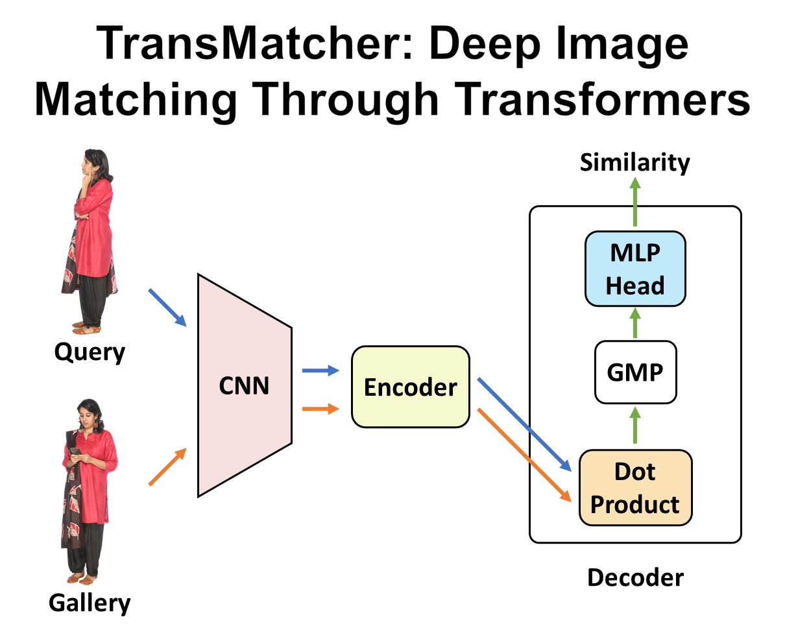

# TransMatcher
[Transformer-Based Deep Image Matching for Generalizable Person Re-identification](https://arxiv.org/abs/2105.14432)

This PyTorch code is proposed in our paper [1]. It is based on the QAConv 2.0 code, and the requrements and usage are quite similar.



For further details, please read our [paper](https://arxiv.org/abs/2105.14432), and a poster [here](TransMatcher_Poster.png).

# Performance

Performance (%) of TransMatcher under direct cross-dataset evaluation without transfer learning or domain adaptation:

<table align="center">
  <tr align="center">
    <td rowspan="2">Training Data</td>
    <td rowspan="2">Method</td>
    <td colspan="2">CUHK03-NP</td>
    <td colspan="2">Market-1501</td>
    <td colspan="2">MSMT17</td>
  </tr>
  <tr align="center">
    <td>Rank-1</td>
    <td>mAP</td>
    <td>Rank-1</td>
    <td>mAP</td>
    <td>Rank-1</td>
    <td>mAP</td>
  </tr>
  <tr align="center">
    <td rowspan="2">Market</td>
    <td>QAConv 2.0</td>
    <td><b>16.4</b></td>
    <td><b>15.7</b></td>
    <td>-</td>
    <td>-</td>
    <td><b>41.2</b></td>
    <td><b>15.0</b></td>
  </tr>
  <tr align="center">
    <td>TransMatcher</td>
    <td>22.2</td>
    <td>21.4</td>
    <td>-</td>
    <td>-</td>
    <td>47.3</td>
    <td>18.4</td>
  </tr>
  <tr align="center">
    <td rowspan="2">MSMT</td>
    <td>QAConv 2.0</td>
    <td><b>20.0</b></td>
    <td><b>19.2</b></td>
    <td><b>75.1</b></td>
    <td><b>46.7</b></td>
    <td>-</td>
    <td>-</td>
  </tr>
  <tr align="center">
    <td>TransMatcher</td>
    <td>23.7</td>
    <td>22.5</td>
    <td>80.1</td>
    <td>52.0</td>
    <td>-</td>
    <td>-</td>
  </tr>
  <tr align="center">
    <td rowspan="2">MSMT (all)</td>
    <td>QAConv 2.0</td>
    <td><b>27.2</b></td>
    <td><b>27.1</b></td>
    <td><b>80.6</b></td>
    <td><b>55.6</b></td>
    <td>-</td>
    <td>-</td>
  </tr>
  <tr align="center">
    <td>TransMatcher</td>
    <td>31.9</td>
    <td>30.7</td>
    <td>82.6</td>
    <td>58.4</td>
    <td>-</td>
    <td>-</td>
  </tr>
  <tr align="center">
    <td rowspan="2">RandPerson</td>
    <td>QAConv 2.0</td>
    <td><b>14.8</b></td>
    <td><b>13.4</b></td>
    <td><b>74.0</b></td>
    <td><b>43.8</b></td>
    <td><b>42.4</b></td>
    <td><b>14.4</b></td>
  </tr>
  <tr align="center">
    <td>TransMatcher</td>
    <td>17.1</td>
    <td>16.0</td>
    <td>77.3</td>
    <td>49.1</td>
    <td>48.3</td>
    <td>17.7</td>
  </tr>
</table>

# Contacts

Shengcai Liao  
Inception Institute of Artificial Intelligence (IIAI)  
shengcai.liao@inceptioniai.org

# Citation
[1] Shengcai Liao and Ling Shao, "TransMatcher: Deep Image Matching Through Transformers for Generalizable Person Re-identification." In Neural Information Processing Systems (NeurIPS), 2021.

```
@article{Liao-NeurIPS2021-TransMatcher,
  author    = {Shengcai Liao and Ling Shao},
  title     = {{TransMatcher: Deep Image Matching Through Transformers for Generalizable Person Re-identification}},
  booktitle = {Neural Information Processing Systems (NeurIPS)},  
  year={2021}
}
```